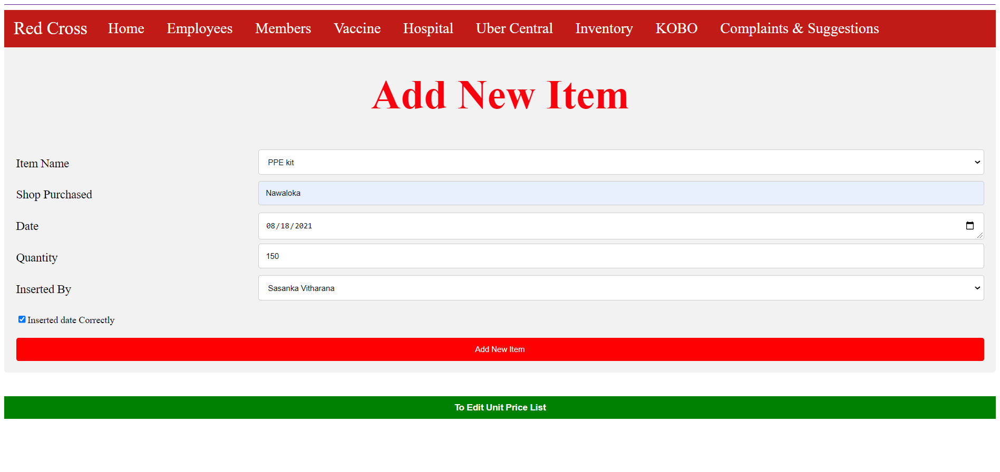
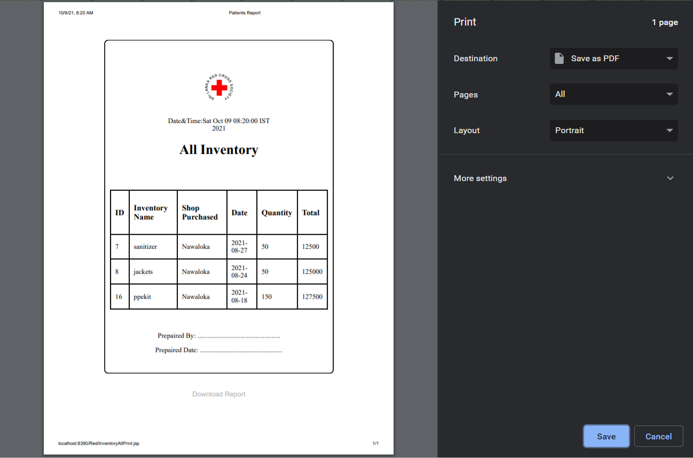
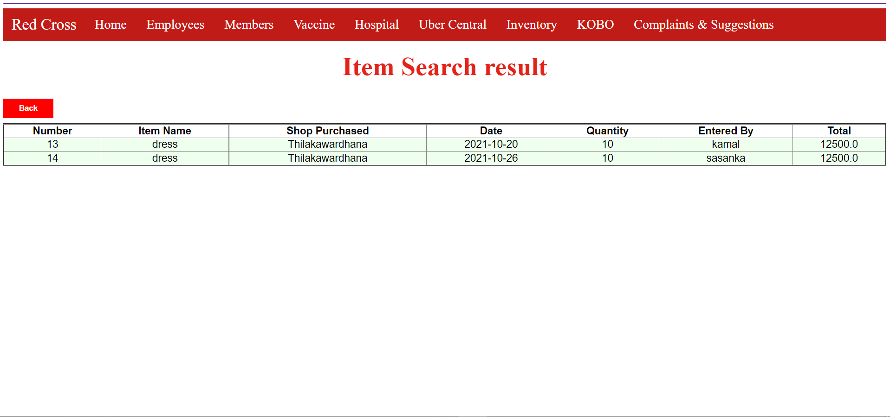
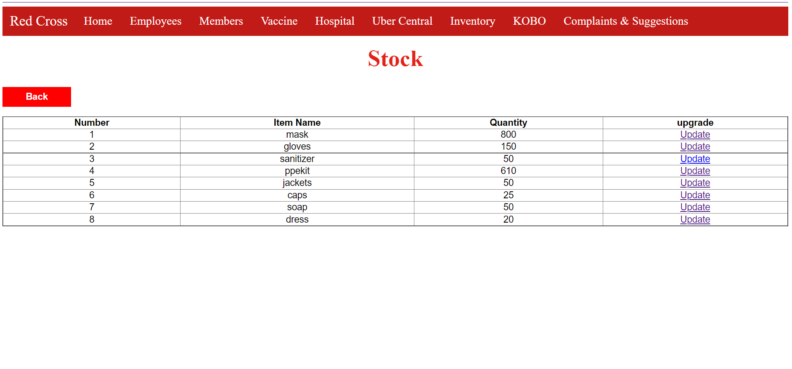
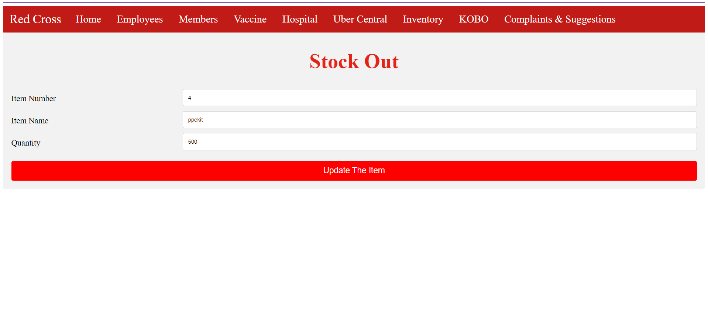
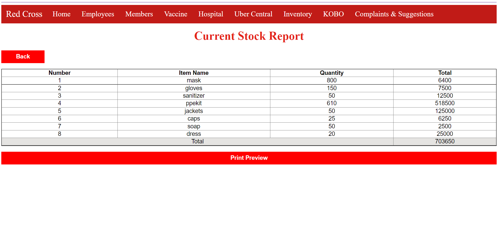
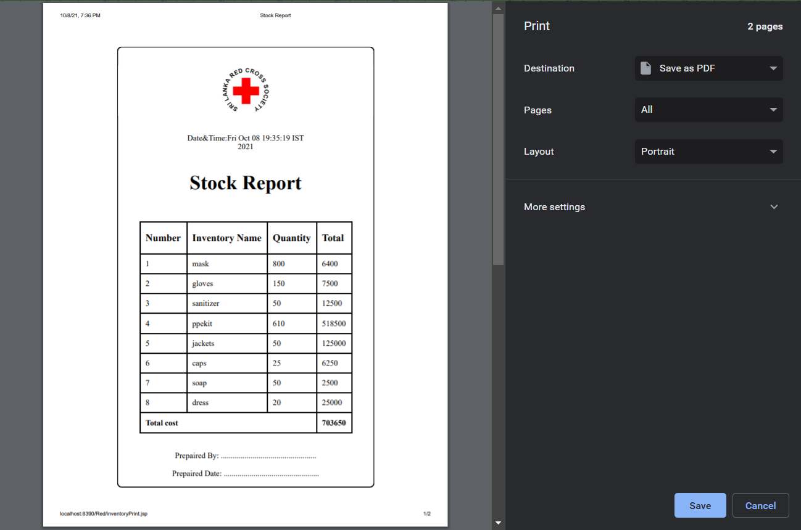

# RedCross-Inventory
This is the red cross inventory handle part

### About the Project

    

    

    

    

    

    

    

    
</p

### IDEs and Technologies 
* Eclipse workspace
* XAMPP server
* phpMyAdmin
* Apache Tomcat 9
